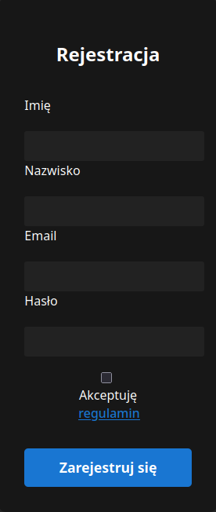
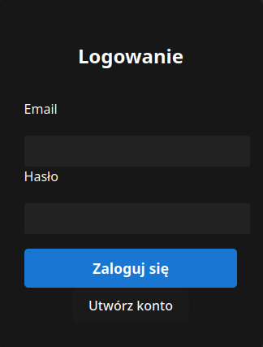
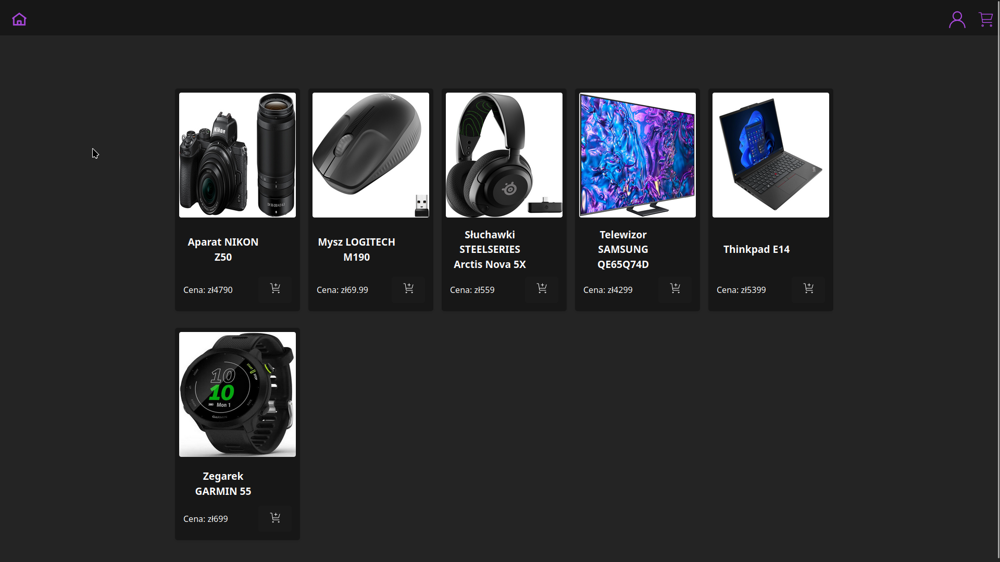
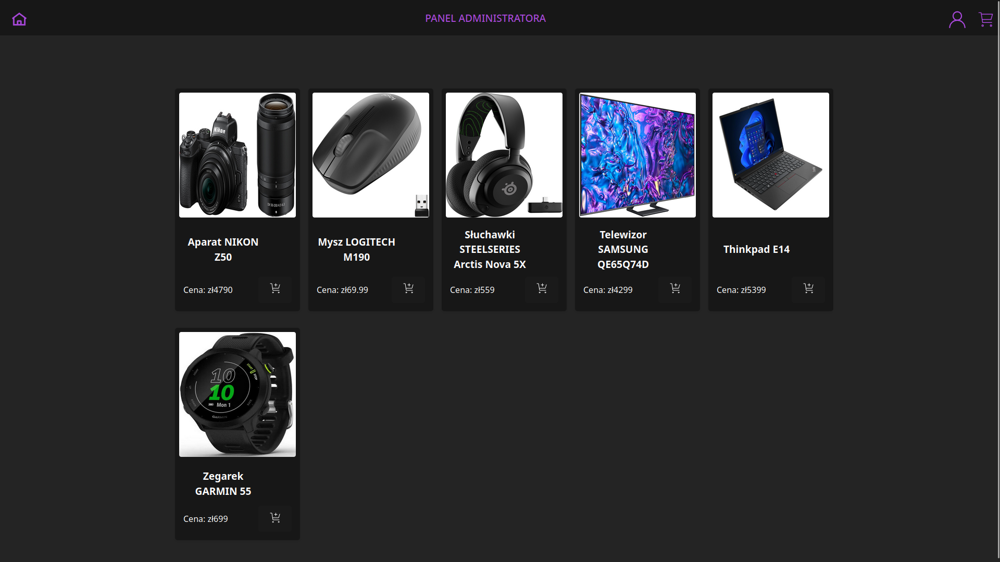
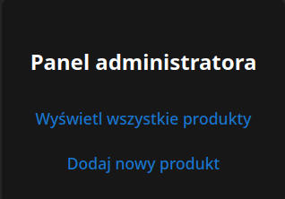
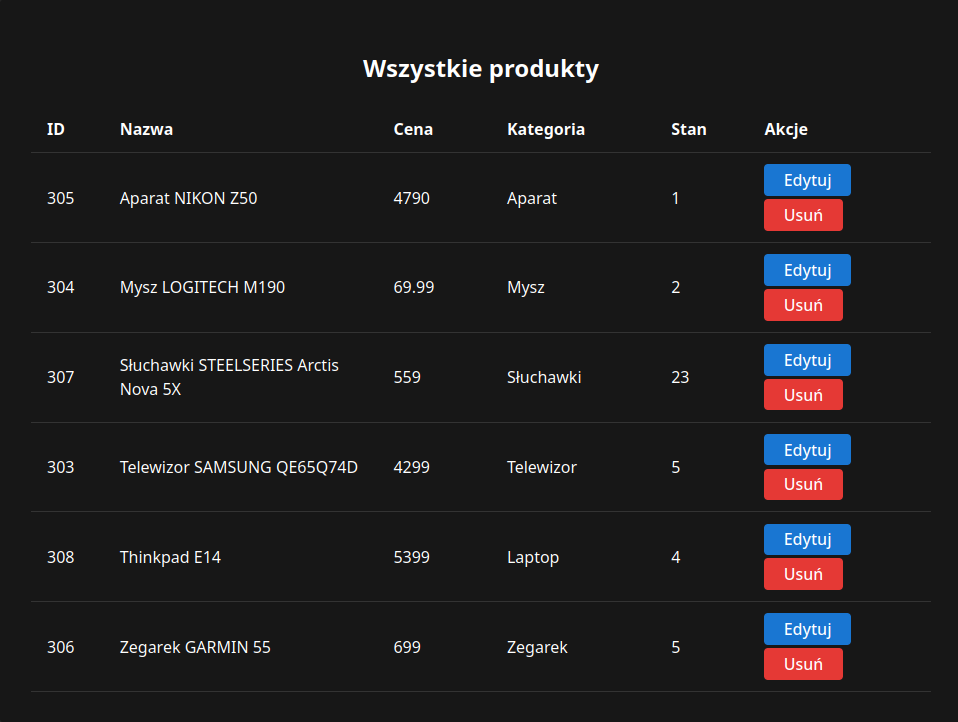
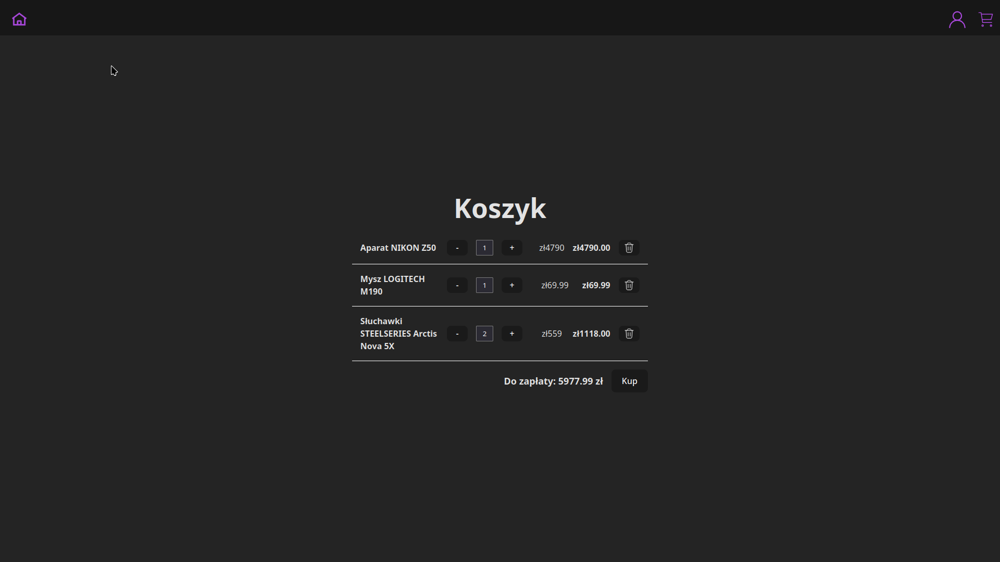
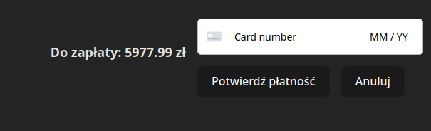
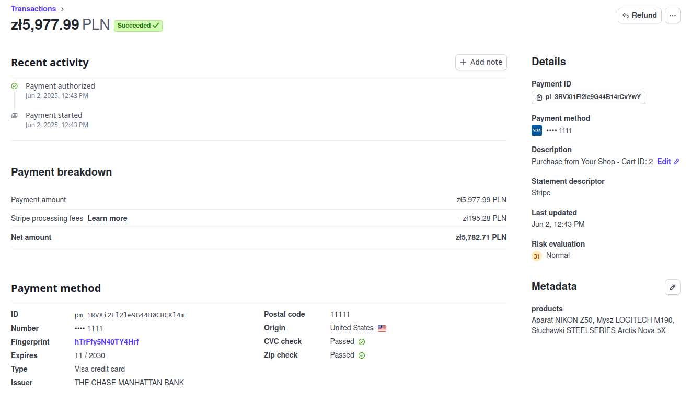

# Sklep internetowy

**Autor**: Michał Marciniak  
**Data**: Czerwiec 2025  
**Repozytorium**: [Github](https://github.com/Mkkami/SklepInternetowy)

---

## Założenia i zakres projektu

### Cel projektu

Celem projektu było stworzenie funkcjonalnej aplikacji webowej - sklepu internetowego, umożliwiającej użytkownikom przeglądanie i zakup elektroniki, a administratorowi - zarządzanie produktami.

### Zakres funkcjonalny

- Rejestracja i logowanie użytkowników (JWT)  
- Przeglądanie produktów  
- Dodawanie produktów do koszyka  
- Składanie zamówień  
- Zarządzanie produktami  
- Interfejs użytkownika  

---

## Oprogramowanie i narzędzia wspomagające

### Backend

- Java 21 + Spring Boot 3
  - Spring Web, Spring Security + JWT, Spring Data JPA
- PostgreSQL - baza danych
- Docker - konteneryzacja bazy danych
- Stripe - obsługa płatności
- Maven - zarządzanie zależnościami

### Frontend

- Typescript + React 19  
- Vite - narzędzie do budowy projektu  

### Inne narzędzia

- Postman - testowanie API  
- Git + Github - wersjonowanie  

---

## Opis aplikacji

Aplikacja składa się z 2 głównych części:

### Frontend

- Strona główna z listą produktów  
- Widok szczegółów produktów  
- Koszyk i płatności (Stripe)  
- Logowanie i rejestracja  
- Panel administratora - zarządzanie produktami

### Backend

- REST API z podziałem na role użytkownika i właściciela  
- JWT - logowanie i autoryzacja  
- Obsługa operacji CRUD na produktach  
- Walidacja danych  
- Komunikacja z bazą danych  

---

## Co udało się zrobić, a co zostało do zrobienia

### Ukończone funkcje:

- Logowanie i rejestracja z wykorzystaniem JWT  
- Obsługa koszyka i płatności  
- Interfejs użytkownika  
- Panel administratora  
- REST API do historii zamówień i obsługi produktów  

### Do zrobienia:
- Widok opisu produktów i historii zamówień
- Edycja informacji o produktach 
---

## Zrzuty ekranu

  
*Rysunek 1: Strona główna gościa*

  
*Rysunek 2: Okno rejestracji*

  
*Rysunek 3: Okno logowania*

  
*Rysunek 4: Strona główna zalogowanego użytkownika*

  
*Rysunek 5: Strona główna właściciela (dostępny panel administratora)*

  
*Rysunek 6: Panel administratora*

  
*Rysunek 7: Panel zarządzania produktami*

  
*Rysunek 8: Koszyk z produktami*

  
*Rysunek 9: Okno płatności*

  
*Rysunek 10: Test płatności w stripe*

## Podsumowanie
Projekt sklepu internetowego został zrealizowany z powodzeniem w zakresie założeń funkcjonalnych. Udało się stworzyć działającą aplikację webową z interfejsem użytkownika, autoryzacją opartą na JWT, obsługą koszyka, panelu administratora oraz integracją z systemem Stripe.
Jest kilka obszarów wymagających dalszego rozwoju, takich jak szczegółowy widok produktu czy możliwość edycji informajci o produktach.
Projekt pozwolił na stworzenie aplikacji webowej oraz zdobycie wiedzy w zakresie projektowania architektury aplikacji, integracji z zewnętrzymi usługami oraz zarządzania dostępem użytkowników.